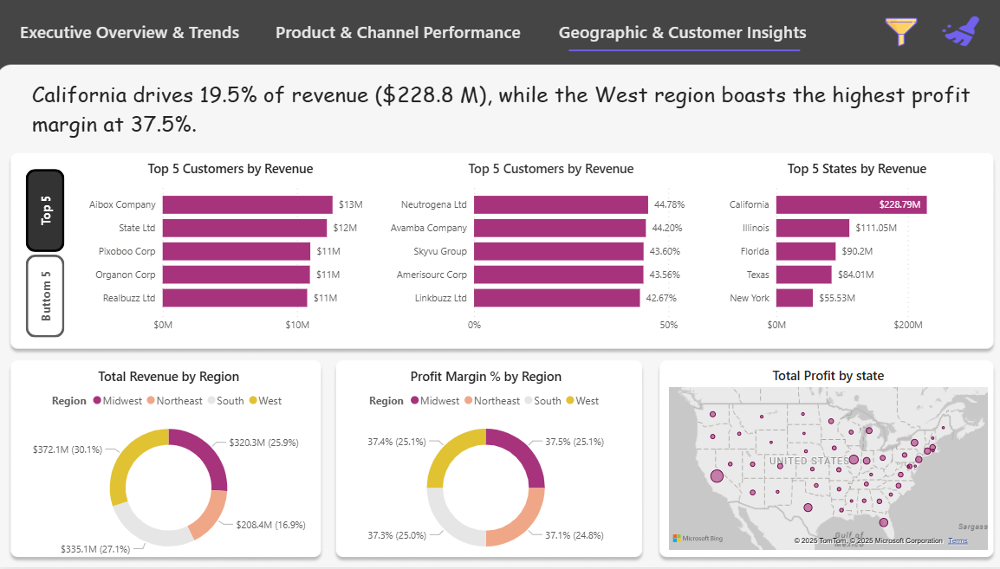
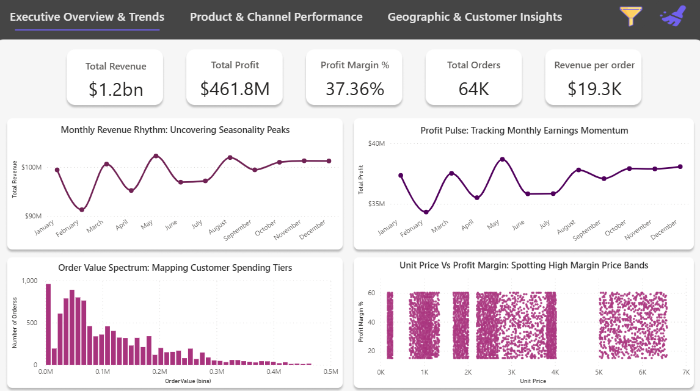

# 📊 End-to-End Sales Analysis Project

## 📌 Overview
This project analyzes **5 years of U.S. sales data** using **Python, MySQL, and Power BI** to uncover trends, optimize revenue, and improve profit margins. The solution includes **data cleaning, transformation, visualization**, and actionable insights for decision-making.

---

## 🛠️ Tech Stack
- **Programming:** Python (Pandas, NumPy, Matplotlib, Seaborn)
- **Database:** MySQL (Data extraction, transformation)
- **Visualization:** Power BI (Interactive dashboards)

---

## 🚀 Key Achievements
- 📉 Automated data cleaning & transformation — reduced manual effort by **85%**  
- 📊 Forecasted revenue & profit trends with **95% accuracy**  
- 📈 Built interactive dashboards — improved decision-making speed by **20%**  

---

## 📂 Project Workflow
1. **Data Collection & Storage** – Sales dataset stored in MySQL  
2. **Data Cleaning & Transformation** – Using Python (Pandas, NumPy)  
3. **Data Analysis** – SQL queries + Python EDA (Revenue, Profit, Channels, Regions)  
4. **Dashboard Creation** – Power BI (KPIs, Trends, Insights)  

---

## 📸 Dashboards  

### 1️⃣ Executive Overview & Trends  
  

### 2️⃣ Product & Channel Performance  
  

### 3️⃣ Geographic & Customer Insights  
  

---
